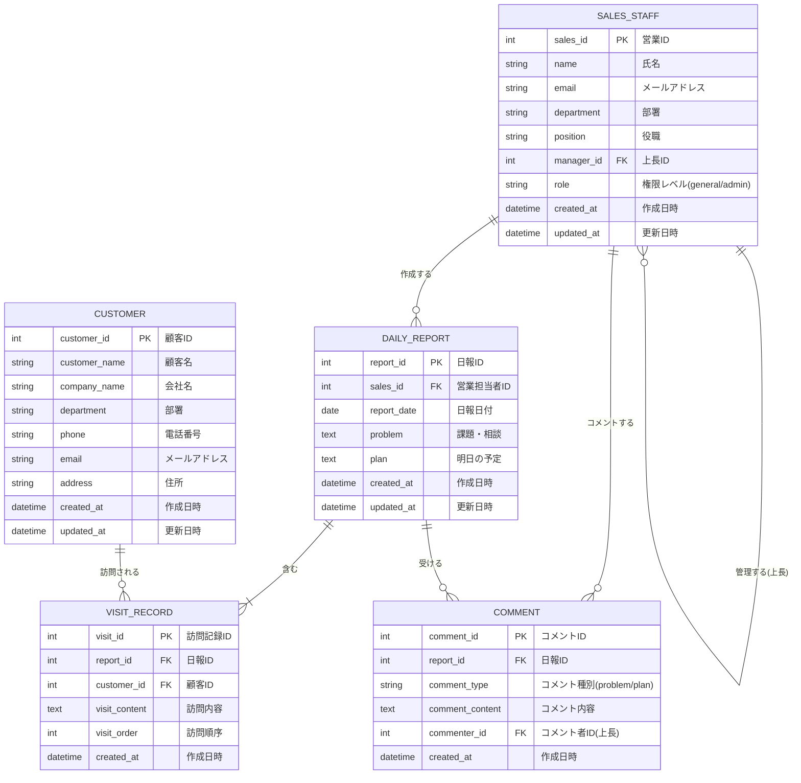

# 営業日報システム 要件定義書

## 1. システム概要

営業担当者が日々の訪問活動を記録し、上長が確認・コメントできる営業日報管理システム

## 2. 主要機能

### 2.1 日報管理機能

#### 日報作成
- 1日1件の日報を作成
- 訪問記録の複数登録（顧客選択、訪問内容入力）
- 課題・相談（Problem）の記入
- 明日の予定（Plan）の記入

#### 日報閲覧
- 自分の過去日報の閲覧
- 部下の日報閲覧（上長のみ）

#### コメント機能
- 上長がProblemとPlanにコメント可能

### 2.2 マスタ管理機能

#### 顧客マスタ管理
- 顧客情報の登録・編集・削除

#### 営業マスタ管理
- 営業担当者情報の登録・編集・削除
- 上長-部下の関係設定

## 3. ユーザー種別

- **営業担当者**: 日報作成・閲覧
- **上長**: 日報閲覧・コメント・マスタ管理

## 4. データ要件

### 4.1 日報（Daily Report）
- 日報ID
- 営業担当者ID
- 日付
- 課題・相談（Problem）
- 明日の予定（Plan）
- 作成日時
- 更新日時

### 4.2 訪問記録（Visit Record）
- 訪問記録ID
- 日報ID
- 顧客ID
- 訪問内容
- 訪問順序
- 作成日時

### 4.3 コメント（Comment）
- コメントID
- 日報ID
- コメント種別（Problem/Plan）
- コメント内容
- コメント者ID（上長）
- 作成日時

### 4.4 顧客マスタ（Customer）
- 顧客ID
- 顧客名
- 会社名
- 部署
- 電話番号
- メールアドレス
- 住所
- 作成日時
- 更新日時

### 4.5 営業マスタ（Sales Staff）
- 営業ID
- 氏名
- メールアドレス
- 部署
- 役職
- 上長ID
- 権限レベル（一般/管理者）
- 作成日時
- 更新日時

## 5. ER図

## 6. リレーションシップ説明

1. **SALES_STAFF ↔ DAILY_REPORT**: 1対多（1人の営業が複数の日報を作成）
2. **SALES_STAFF ↔ SALES_STAFF**: 自己参照（上長-部下関係）
3. **DAILY_REPORT ↔ VISIT_RECORD**: 1対多（1つの日報に複数の訪問記録）
4. **CUSTOMER ↔ VISIT_RECORD**: 1対多（1顧客が複数回訪問される）
5. **DAILY_REPORT ↔ COMMENT**: 1対多（1つの日報に複数のコメント）
6. **SALES_STAFF ↔ COMMENT**: 1対多（1人の上長が複数のコメントを投稿）

## 7. 制約事項

- 日報は営業担当者×日付でユニーク（1日1件のみ）
- 訪問順序で訪問記録をソート表示
- コメント種別は'problem'または'plan'のみ
- 上長IDはNULL可（最上位管理者の場合）

## 8. 非機能要件（検討事項）

### セキュリティ
- ログイン認証機能
- 部下の日報のみ閲覧可能（他部署の日報は閲覧不可）

### パフォーマンス
- 日報一覧のページネーション
- 検索機能（日付範囲、営業担当者、顧客名）

### ユーザビリティ
- レスポンシブデザイン（PC/タブレット/スマートフォン対応）
- 日報のテンプレート機能
- 顧客情報の検索・オートコンプリート