# 営業日報システム 画面定義書

## 1. 画面一覧

| 画面ID | 画面名 | 説明 | アクセス権限 |
|--------|--------|------|-------------|
| SC-001 | ログイン画面 | システムへのログイン | 全員 |
| SC-002 | ダッシュボード | トップ画面・メニュー | 全員 |
| SC-003 | 日報作成・編集画面 | 日報の新規作成・編集 | 営業担当者 |
| SC-004 | 日報詳細画面 | 日報の閲覧・コメント | 全員 |
| SC-005 | 日報一覧画面 | 日報の検索・一覧表示 | 全員 |
| SC-006 | 顧客マスタ一覧画面 | 顧客の一覧・検索 | 全員 |
| SC-007 | 顧客マスタ登録・編集画面 | 顧客情報の登録・編集 | 上長 |
| SC-008 | 営業マスタ一覧画面 | 営業担当者の一覧 | 上長 |
| SC-009 | 営業マスタ登録・編集画面 | 営業担当者の登録・編集 | 上長 |

---

## 2. 画面詳細仕様

### SC-001: ログイン画面

#### 概要
システムへのログイン認証を行う

#### レイアウト
```
┌─────────────────────────────────┐
│    営業日報システム              │
│                                 │
│  ┌─────────────────────┐        │
│  │ メールアドレス      │        │
│  │ [_______________]   │        │
│  │                     │        │
│  │ パスワード          │        │
│  │ [_______________]   │        │
│  │                     │        │
│  │   [ログイン]        │        │
│  └─────────────────────┘        │
└─────────────────────────────────┘
```

#### 入力項目
| 項目名 | 必須 | 形式 | 備考 |
|--------|------|------|------|
| メールアドレス | ○ | text | email形式 |
| パスワード | ○ | password | 最低8文字 |

#### ボタン・アクション
| ボタン名 | アクション |
|----------|-----------|
| ログイン | 認証後、ダッシュボードへ遷移 |

#### バリデーション
- メールアドレス形式チェック
- 未入力チェック
- 認証失敗時はエラーメッセージ表示

---

### SC-002: ダッシュボード

#### 概要
システムのトップ画面。各機能へのメニューと本日の概要を表示

#### レイアウト
```
┌─────────────────────────────────────────────┐
│ [ロゴ] 営業日報システム    [ユーザー名▼]   │
├─────────────────────────────────────────────┤
│ ■ ダッシュボード                            │
│                                             │
│ ┌────────────────┐  ┌─────────────────┐    │
│ │ 📝 日報作成     │  │ 📊 日報一覧     │    │
│ │                │  │                 │    │
│ └────────────────┘  └─────────────────┘    │
│                                             │
│ ┌────────────────┐  ┌─────────────────┐    │
│ │ 👥 顧客マスタ   │  │ 👤 営業マスタ   │    │
│ │                │  │   (上長のみ)    │    │
│ └────────────────┘  └─────────────────┘    │
│                                             │
│ 【本日の概要】                              │
│ ┌─────────────────────────────────────┐    │
│ │ 未提出の日報: 1件                     │    │
│ │ 未読コメント: 3件                     │    │
│ │ 部下の未提出日報: 2件 (上長のみ)     │    │
│ └─────────────────────────────────────┘    │
└─────────────────────────────────────────────┘
```

#### 表示項目
- ユーザー名（ドロップダウン：マイページ・ログアウト）
- 主要機能へのリンクカード
- 本日の概要（未提出日報数、未読コメント数など）

#### ボタン・アクション
| ボタン名 | アクション |
|----------|-----------|
| 日報作成 | SC-003へ遷移 |
| 日報一覧 | SC-005へ遷移 |
| 顧客マスタ | SC-006へ遷移 |
| 営業マスタ | SC-008へ遷移（上長のみ） |

---

### SC-003: 日報作成・編集画面

#### 概要
日報の新規作成または編集を行う

#### レイアウト
```
┌─────────────────────────────────────────────┐
│ [戻る] 日報作成                             │
├─────────────────────────────────────────────┤
│ 日付: 2024年1月15日 (月)                    │
│                                             │
│ ─── 訪問記録 ───                           │
│ ┌─────────────────────────────────────┐    │
│ │ 1. 顧客: [▼ 株式会社ABC      ]       │    │
│ │    訪問内容:                          │    │
│ │    [_____________________________]   │    │
│ │    [_____________________________]   │    │
│ │                          [削除]      │    │
│ └─────────────────────────────────────┘    │
│ ┌─────────────────────────────────────┐    │
│ │ 2. 顧客: [▼ 選択してください  ]       │    │
│ │    訪問内容:                          │    │
│ │    [_____________________________]   │    │
│ │    [_____________________________]   │    │
│ │                          [削除]      │    │
│ └─────────────────────────────────────┘    │
│               [+ 訪問記録を追加]            │
│                                             │
│ ─── 課題・相談（Problem） ───              │
│ ┌─────────────────────────────────────┐    │
│ │                                       │    │
│ │                                       │    │
│ │                                       │    │
│ └─────────────────────────────────────┘    │
│                                             │
│ ─── 明日の予定（Plan） ───                 │
│ ┌─────────────────────────────────────┐    │
│ │                                       │    │
│ │                                       │    │
│ │                                       │    │
│ └─────────────────────────────────────┘    │
│                                             │
│         [下書き保存]      [提出]            │
└─────────────────────────────────────────────┘
```

#### 入力項目
| 項目名 | 必須 | 形式 | 備考 |
|--------|------|------|------|
| 日付 | ○ | date | 当日または過去日のみ選択可 |
| 訪問記録 - 顧客 | ○ | select | 顧客マスタから選択 |
| 訪問記録 - 訪問内容 | ○ | textarea | 500文字以内 |
| 課題・相談 | - | textarea | 1000文字以内 |
| 明日の予定 | - | textarea | 1000文字以内 |

#### ボタン・アクション
| ボタン名 | アクション |
|----------|-----------|
| 訪問記録を追加 | 訪問記録フォームを追加 |
| 削除 | 該当の訪問記録を削除 |
| 下書き保存 | 下書きとして保存し、一覧へ戻る |
| 提出 | 日報を提出し、詳細画面へ遷移 |
| 戻る | 一覧画面へ戻る（確認ダイアログ表示） |

#### バリデーション
- 訪問記録は最低1件必須
- 顧客の重複チェック（同一日報内）
- 未入力項目のチェック

---

### SC-004: 日報詳細画面

#### 概要
日報の詳細内容を表示し、上長がコメントを追加できる

#### レイアウト
```
┌─────────────────────────────────────────────┐
│ [戻る] 日報詳細                [編集]       │
├─────────────────────────────────────────────┤
│ 営業: 山田太郎                              │
│ 日付: 2024年1月15日 (月)                    │
│ 提出日時: 2024-01-15 18:30                  │
│                                             │
│ ─── 訪問記録 ───                           │
│ ┌─────────────────────────────────────┐    │
│ │ 1. 株式会社ABC 営業部                 │    │
│ │    新商品の提案を実施。好感触だが     │    │
│ │    決裁者との面談が必要。             │    │
│ └─────────────────────────────────────┘    │
│ ┌─────────────────────────────────────┐    │
│ │ 2. 株式会社XYZ 総務部                 │    │
│ │    契約更新の商談。価格交渉あり。     │    │
│ └─────────────────────────────────────┘    │
│                                             │
│ ─── 課題・相談（Problem） ───              │
│ ┌─────────────────────────────────────┐    │
│ │ ABC社の決裁者へのアプローチ方法       │    │
│ │ について相談したい。                  │    │
│ └─────────────────────────────────────┘    │
│                                             │
│ 💬 上長コメント (by 佐藤部長)              │
│ ┌─────────────────────────────────────┐    │
│ │ 来週の部会で同席するので、            │    │
│ │ その際に紹介します。                  │    │
│ │ 2024-01-15 20:15                      │    │
│ └─────────────────────────────────────┘    │
│                                             │
│ [コメントを追加] (上長のみ)                 │
│ ┌─────────────────────────────────────┐    │
│ │                                       │    │
│ └─────────────────────────────────────┘    │
│                              [送信]         │
│                                             │
│ ─── 明日の予定（Plan） ───                 │
│ ┌─────────────────────────────────────┐    │
│ │ ABC社：提案資料のブラッシュアップ     │    │
│ │ XYZ社：見積書の提出                   │    │
│ └─────────────────────────────────────┘    │
│                                             │
│ 💬 上長コメント (by 佐藤部長)              │
│ ┌─────────────────────────────────────┐    │
│ │ 了解です。頑張ってください。          │    │
│ │ 2024-01-15 20:16                      │    │
│ └─────────────────────────────────────┘    │
│                                             │
│ [コメントを追加] (上長のみ)                 │
│ ┌─────────────────────────────────────┐    │
│ │                                       │    │
│ └─────────────────────────────────────┘    │
│                              [送信]         │
└─────────────────────────────────────────────┘
```

#### 表示項目
- 営業担当者名
- 日付
- 提出日時
- 訪問記録一覧
- 課題・相談（Problem）と関連コメント
- 明日の予定（Plan）と関連コメント

#### ボタン・アクション（営業担当者）
| ボタン名 | アクション |
|----------|-----------|
| 編集 | SC-003へ遷移（自分の日報のみ） |
| 戻る | SC-005へ遷移 |

#### ボタン・アクション（上長）
| ボタン名 | アクション |
|----------|-----------|
| 送信 | コメントを投稿・画面更新 |

#### バリデーション
- コメントは500文字以内

---

### SC-005: 日報一覧画面

#### 概要
日報の検索・一覧表示を行う

#### レイアウト
```
┌─────────────────────────────────────────────┐
│ 日報一覧                      [新規作成]    │
├─────────────────────────────────────────────┤
│ ─── 検索条件 ───                           │
│ 期間: [2024-01-01] ～ [2024-01-31]         │
│ 営業: [▼ 全員        ] (上長のみ)          │
│ 顧客: [          ] (部分一致)              │
│ ステータス: [▼ すべて ] (提出済/下書き)    │
│                              [検索]         │
│                                             │
│ ─── 検索結果: 25件 ───                     │
│ ┌─────────────────────────────────────┐    │
│ │ 2024-01-15 山田太郎 ✅提出済          │    │
│ │ 訪問: 株式会社ABC, 株式会社XYZ        │    │
│ │ 💬 コメント2件                        │    │
│ └─────────────────────────────────────┘    │
│ ┌─────────────────────────────────────┐    │
│ │ 2024-01-14 山田太郎 ✅提出済          │    │
│ │ 訪問: 株式会社DEF                     │    │
│ │ 💬 コメント1件                        │    │
│ └─────────────────────────────────────┘    │
│ ┌─────────────────────────────────────┐    │
│ │ 2024-01-13 山田太郎 📝下書き          │    │
│ │ 訪問: 株式会社GHI                     │    │
│ └─────────────────────────────────────┘    │
│                                             │
│          [前へ]  1 / 3  [次へ]              │
└─────────────────────────────────────────────┘
```

#### 検索条件
| 項目名 | 形式 | 備考 |
|--------|------|------|
| 期間（開始） | date | デフォルト：当月1日 |
| 期間（終了） | date | デフォルト：当月末日 |
| 営業担当者 | select | 上長のみ表示。部下を選択可 |
| 顧客名 | text | 部分一致検索 |
| ステータス | select | すべて/提出済/下書き |

#### 表示項目（一覧）
- 日付
- 営業担当者名
- ステータス（提出済/下書き）
- 訪問顧客（最大3件、以降は「他N件」）
- コメント件数

#### ボタン・アクション
| ボタン名 | アクション |
|----------|-----------|
| 新規作成 | SC-003へ遷移 |
| 検索 | 検索条件で絞り込み |
| 各日報行 | SC-004へ遷移 |
| 前へ/次へ | ページネーション |

#### 備考
- 1ページあたり10件表示
- デフォルトは当月の自分の日報を表示
- 上長は部下の日報も閲覧可能

---

### SC-006: 顧客マスタ一覧画面

#### 概要
顧客情報の一覧・検索を行う

#### レイアウト
```
┌─────────────────────────────────────────────┐
│ 顧客マスタ                    [新規登録]    │
├─────────────────────────────────────────────┤
│ ─── 検索条件 ───                           │
│ 顧客名・会社名: [              ]            │
│                              [検索]         │
│                                             │
│ ─── 検索結果: 48件 ───                     │
│ ┌─────────────────────────────────────┐    │
│ │ 株式会社ABC                           │    │
│ │ 担当: 鈴木一郎 (営業部)               │    │
│ │ TEL: 03-1234-5678                     │    │
│ │                    [編集] [削除]      │    │
│ └─────────────────────────────────────┘    │
│ ┌─────────────────────────────────────┐    │
│ │ 株式会社XYZ                           │    │
│ │ 担当: 田中花子 (総務部)               │    │
│ │ TEL: 03-2345-6789                     │    │
│ │                    [編集] [削除]      │    │
│ └─────────────────────────────────────┘    │
│                                             │
│          [前へ]  1 / 5  [次へ]              │
└─────────────────────────────────────────────┘
```

#### 検索条件
| 項目名 | 形式 | 備考 |
|--------|------|------|
| 顧客名・会社名 | text | 部分一致検索 |

#### 表示項目（一覧）
- 会社名
- 担当者名（顧客名）
- 部署
- 電話番号

#### ボタン・アクション
| ボタン名 | アクセス権限 | アクション |
|----------|-------------|-----------|
| 新規登録 | 上長 | SC-007へ遷移（新規モード） |
| 編集 | 上長 | SC-007へ遷移（編集モード） |
| 削除 | 上長 | 確認ダイアログ後、削除実行 |
| 前へ/次へ | 全員 | ページネーション |

#### 備考
- 1ページあたり10件表示
- 営業担当者は閲覧のみ可能

---

### SC-007: 顧客マスタ登録・編集画面

#### 概要
顧客情報の登録・編集を行う（上長のみ）

#### レイアウト
```
┌─────────────────────────────────────────────┐
│ [戻る] 顧客情報登録                         │
├─────────────────────────────────────────────┤
│ 会社名 *                                    │
│ [_____________________________________]    │
│                                             │
│ 顧客名（担当者名） *                        │
│ [_____________________________________]    │
│                                             │
│ 部署                                        │
│ [_____________________________________]    │
│                                             │
│ 電話番号                                    │
│ [_____________________________________]    │
│                                             │
│ メールアドレス                              │
│ [_____________________________________]    │
│                                             │
│ 住所                                        │
│ [_____________________________________]    │
│ [_____________________________________]    │
│                                             │
│              [キャンセル]  [保存]           │
└─────────────────────────────────────────────┘
```

#### 入力項目
| 項目名 | 必須 | 形式 | 備考 |
|--------|------|------|------|
| 会社名 | ○ | text | 100文字以内 |
| 顧客名 | ○ | text | 50文字以内 |
| 部署 | - | text | 50文字以内 |
| 電話番号 | - | tel | ハイフンあり/なし両対応 |
| メールアドレス | - | email | email形式 |
| 住所 | - | textarea | 200文字以内 |

#### ボタン・アクション
| ボタン名 | アクション |
|----------|-----------|
| 保存 | 登録/更新後、一覧へ戻る |
| キャンセル | 一覧へ戻る（確認ダイアログ） |
| 戻る | 一覧へ戻る（確認ダイアログ） |

#### バリデーション
- 必須項目チェック
- メールアドレス形式チェック
- 電話番号形式チェック（数字とハイフンのみ）

---

### SC-008: 営業マスタ一覧画面

#### 概要
営業担当者情報の一覧を表示（上長のみアクセス可）

#### レイアウト
```
┌─────────────────────────────────────────────┐
│ 営業マスタ                    [新規登録]    │
├─────────────────────────────────────────────┤
│ ─── 検索条件 ───                           │
│ 氏名: [              ]                      │
│ 部署: [▼ すべて ]                          │
│                              [検索]         │
│                                             │
│ ─── 検索結果: 15件 ───                     │
│ ┌─────────────────────────────────────┐    │
│ │ 山田太郎                              │    │
│ │ 営業一部 / 主任                       │    │
│ │ 上長: 佐藤部長                        │    │
│ │                    [編集] [削除]      │    │
│ └─────────────────────────────────────┘    │
│ ┌─────────────────────────────────────┐    │
│ │ 佐藤次郎                              │    │
│ │ 営業一部 / 部長                       │    │
│ │ 上長: なし                            │    │
│ │                    [編集] [削除]      │    │
│ └─────────────────────────────────────┘    │
│                                             │
│          [前へ]  1 / 2  [次へ]              │
└─────────────────────────────────────────────┘
```

#### 検索条件
| 項目名 | 形式 | 備考 |
|--------|------|------|
| 氏名 | text | 部分一致検索 |
| 部署 | select | すべて/営業一部/営業二部など |

#### 表示項目（一覧）
- 氏名
- 部署
- 役職
- 上長名

#### ボタン・アクション
| ボタン名 | アクション |
|----------|-----------|
| 新規登録 | SC-009へ遷移（新規モード） |
| 編集 | SC-009へ遷移（編集モード） |
| 削除 | 確認ダイアログ後、削除実行 |
| 前へ/次へ | ページネーション |

---

### SC-009: 営業マスタ登録・編集画面

#### 概要
営業担当者情報の登録・編集を行う（上長のみ）

#### レイアウト
```
┌─────────────────────────────────────────────┐
│ [戻る] 営業担当者登録                       │
├─────────────────────────────────────────────┤
│ 氏名 *                                      │
│ [_____________________________________]    │
│                                             │
│ メールアドレス *                            │
│ [_____________________________________]    │
│                                             │
│ パスワード * (新規登録時のみ)               │
│ [_____________________________________]    │
│                                             │
│ 部署 *                                      │
│ [▼ 営業一部                          ]    │
│                                             │
│ 役職                                        │
│ [_____________________________________]    │
│                                             │
│ 上長 *                                      │
│ [▼ 佐藤部長                          ]    │
│                                             │
│ 権限レベル *                                │
│ ◉ 一般  ○ 管理者                          │
│                                             │
│              [キャンセル]  [保存]           │
└─────────────────────────────────────────────┘
```

#### 入力項目
| 項目名 | 必須 | 形式 | 備考 |
|--------|------|------|------|
| 氏名 | ○ | text | 50文字以内 |
| メールアドレス | ○ | email | email形式、重複不可 |
| パスワード | ○ | password | 新規登録時のみ、8文字以上 |
| 部署 | ○ | select | 営業一部/営業二部など |
| 役職 | - | text | 50文字以内 |
| 上長 | ○ | select | 営業担当者リストから選択 |
| 権限レベル | ○ | radio | 一般/管理者 |

#### ボタン・アクション
| ボタン名 | アクション |
|----------|-----------|
| 保存 | 登録/更新後、一覧へ戻る |
| キャンセル | 一覧へ戻る（確認ダイアログ） |
| 戻る | 一覧へ戻る（確認ダイアログ） |

#### バリデーション
- 必須項目チェック
- メールアドレス形式チェック・重複チェック
- パスワード長チェック（8文字以上）

---

## 3. 画面遷移図

```mermaid
graph LR
    SC001[SC-001<br/>ログイン] --> SC002[SC-002<br/>ダッシュボード]

    SC002 --> SC003[SC-003<br/>日報作成・編集]
    SC002 --> SC005[SC-005<br/>日報一覧]
    SC002 --> SC006[SC-006<br/>顧客マスタ一覧]
    SC002 --> SC008[SC-008<br/>営業マスタ一覧]

    SC003 --> SC004[SC-004<br/>日報詳細]
    SC005 --> SC004
    SC005 --> SC003

    SC004 --> SC003

    SC006 --> SC007[SC-007<br/>顧客マスタ登録・編集]
    SC007 --> SC006

    SC008 --> SC009[SC-009<br/>営業マスタ登録・編集]
    SC009 --> SC008
```



---

## 4. 共通仕様

### ヘッダー
全画面共通（ログイン画面を除く）
- ロゴ・システム名
- ユーザー名表示
- ドロップダウンメニュー（マイページ、ログアウト）

### フッター
全画面共通
- コピーライト表示

### レスポンシブ対応
- PC: 1024px以上
- タブレット: 768px以上
- スマートフォン: 768px未満

### エラーメッセージ
- 入力エラー: 項目の下に赤字で表示
- システムエラー: モーダルダイアログで表示

### 確認ダイアログ
- 削除実行前
- 未保存データがある状態での画面遷移前

### 日付・時刻表示形式
- 日付: YYYY-MM-DD または YYYY年MM月DD日
- 時刻: HH:MM
- 日時: YYYY-MM-DD HH:MM

---

## 5. 非機能要件

### ユーザビリティ
- タブキーによるフォーカス移動対応
- Enterキーによるフォーム送信対応
- プレースホルダーテキストの設定
- ローディング表示（API通信中）

### アクセシビリティ
- WAI-ARIA対応
- キーボード操作対応
- 適切なコントラスト比

### パフォーマンス
- 初期表示: 3秒以内
- 検索・一覧表示: 2秒以内
- ページ遷移: 1秒以内